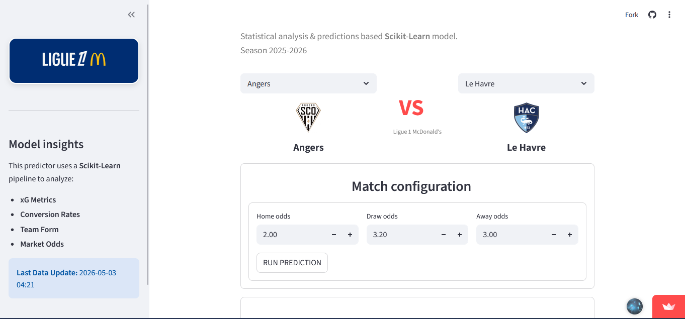

# Ligue 1 Match Predictor — 2025–2026 Season

> A statistical forecasting engine that estimates win, draw, and loss probabilities for matches of the French Ligue 1, built with multinomial logistic regression and deployed as an interactive Streamlit application.

[](https://ligue-1-predictor.streamlit.app/)

[](https://github.com/komiayi/Ligue-1)
[](https://www.python.org/)
[](https://scikit-learn.org/)
[](LICENSE)


<!--
  Once a screenshot of the application interface is available,
  uncomment the line below and place the file at figures/screenshot.png
-->
<!--  -->

---

## Overview

This project provides a **probabilistic match outcome forecaster** for the French Ligue 1 (2025–2026 season). It applies multinomial logistic regression to a curated set of team-level performance indicators in order to estimate, for any given fixture, the probabilities of a home win, a draw, and an away win.

The forecasting engine is exposed through a **Streamlit web application** with a clean light/dark interface, allowing users to select a fixture and obtain calibrated outcome probabilities in real time.

>  **Disclaimer.** This project is intended strictly for **educational and demonstrative purposes**. The probabilities produced by the model do not constitute betting advice, financial recommendations, or any form of professional forecasting service.

---

## Live application

The application is deployed on Streamlit Community Cloud:

> **[ligue-1-predictor.streamlit.app](https://ligue-1-predictor.streamlit.app/)**

If the application appears to be sleeping (Streamlit suspends inactive apps after a period of inactivity), simply click the wake-up button on the landing page and allow a few seconds for the container to restart.

---

## Methodology

The predictive engine relies on a **multinomial logistic regression** model from `scikit-learn`, selected for its interpretability, its native support for multi-class outputs, and its ability to produce calibrated probabilities through `predict_proba`.

- **Outcome variable.** Match result encoded as one of three mutually exclusive classes: home win, draw, away win.
- **Feature set.** Team-level indicators including goals scored and conceded, a relative team strength index, and historical performance metrics, all normalized to the 18-club Ligue 1 format of the 2025–2026 season.
- **Probabilistic output.** Rather than a single hard prediction, the model returns a probability distribution over the three classes, providing a richer representation of match volatility and uncertainty than deterministic forecasts would.

---

## Data sources

Match-level data is sourced from **[Football-Data.co.uk](https://www.football-data.co.uk/)**, a long-standing public repository of European football statistics widely used in academic research and sports analytics.

The dataset is retrieved programmatically across multiple seasons via the following URL pattern:

```
https://www.football-data.co.uk/mmz4281/{season}/F1.csv
```

where `{season}` denotes the season identifier (e.g. `2425` for 2024–2025, `2526` for 2025–2026). Each CSV file provides match-level statistics including final scores, half-time scores, shots, shots on target, fouls, corners, and bookings — from which team-level performance indicators are subsequently engineered.

> **Acknowledgment.** This project relies entirely on data made publicly available by Football-Data.co.uk. The repository does not redistribute the source data; downloads occur at runtime from the original provider.

---

## Technology stack

| Component         | Technology                          |
| ----------------- | ----------------------------------- |
| Core language     | Python 3.12                         |
| Modeling          | scikit-learn                        |
| Data handling     | pandas, NumPy                       |
| Web interface     | Streamlit (custom light/dark theme) |
| Development env.  | VS Code Dev Containers              |
| Version control   | Git / GitHub                        |

---

## Repository structure

```
Ligue-1/
├── .devcontainer/    # VS Code Dev Container configuration
├── data/             # Match data and team-level features
├── figures/          # Static visualizations and screenshots
├── models/           # Serialized trained models
├── scripts/          # Data preparation and training scripts
├── app.py            # Streamlit application entry point
├── requirements.txt  # Python dependencies
└── README.md
```

---

## ⚙️ Installation and local usage

**1. Clone the repository:**

```bash
git clone https://github.com/komiayi/Ligue-1.git
cd Ligue-1
```

**2. Install Python dependencies** (Python 3.12 recommended):

```bash
pip install -r requirements.txt
```

**3. Launch the Streamlit application:**

```bash
streamlit run app.py
```

The application will open automatically in your default browser at `http://localhost:8501`.

---

## Contributing

Suggestions, methodological feedback, and bug reports are welcome through the [Issues](https://github.com/komiayi/Ligue-1/issues) tab. For substantial contributions, please open an issue first to discuss the proposed changes.

---

## License

Distributed under the MIT License. See [`LICENSE`](LICENSE) for full terms.

---

## Author

**Komi Roger Ayi**
Biostatistician — Health Data Analyst
Montréal, Québec, Canada

[Portfolio](https://komiayi.github.io) · [LinkedIn](https://www.linkedin.com/in/komi-ayi) · [GitHub](https://github.com/komiayi)
